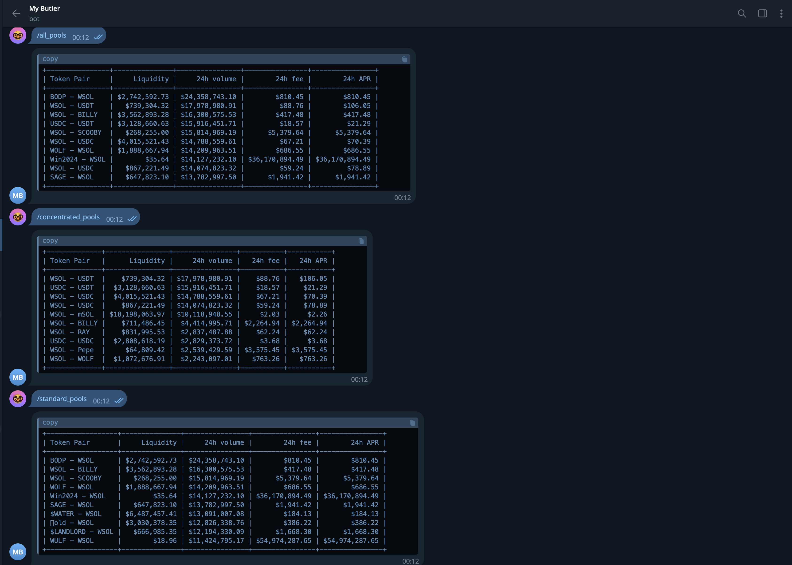

# Bot Solana Raydium

Bot Solana Raydium



Copy or Rename file .env.example to .env

Run command line :

```bash
cp .env.example .env
```

[Create a Telegram Bot](https://www.freecodecamp.org/news/how-to-create-a-telegram-bot-using-python/)

Copy Use this token to access the HTTP API to TELEGRAM_TOKEN

> TELEGRAM_TOKEN={token to access the HTTP API}

Install Python packages run command line :

```bash
pip install -r requirements.txt
```

Run Bot :

```bash
python botSol.py
```
